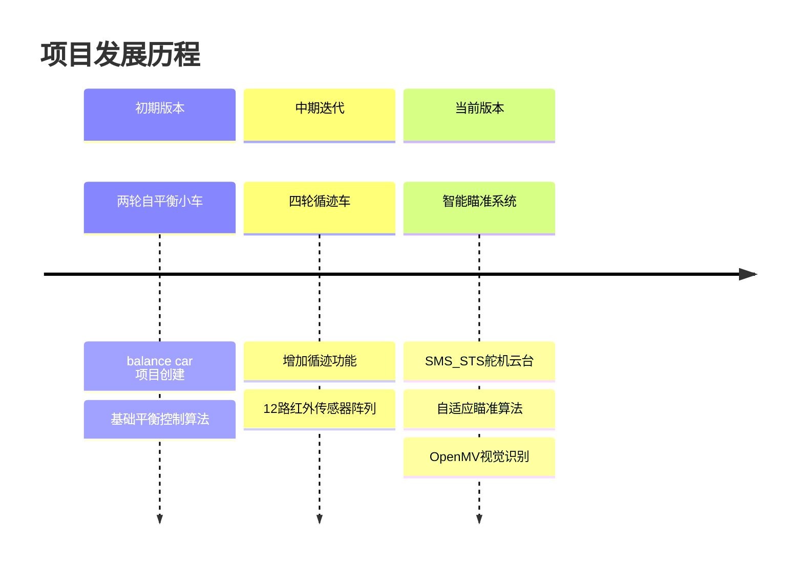
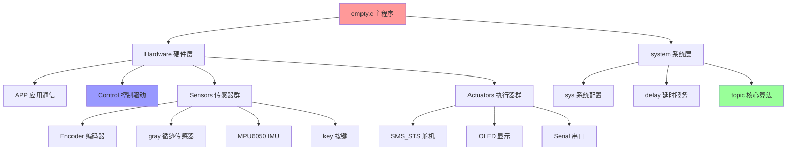
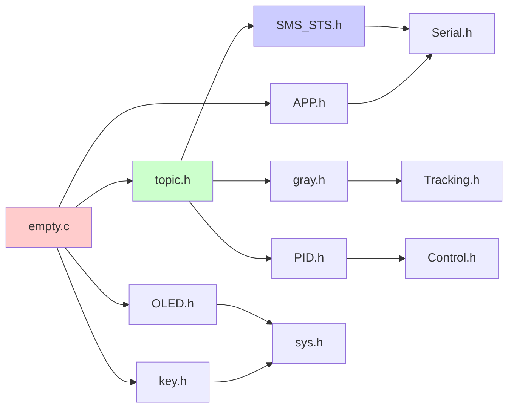
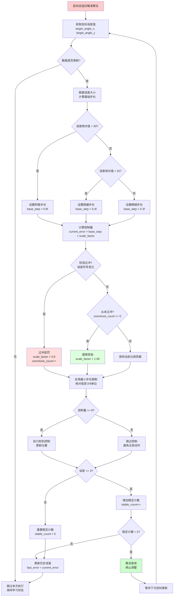
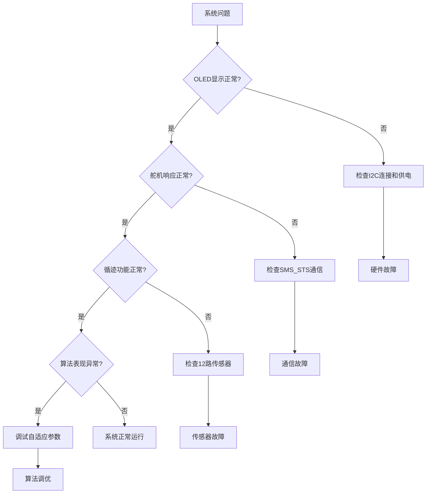

# 🎯 【交接专用】智能自动瞄准小车超详细说明文档

> **🚨 新手必读：本文档已针对零基础接手者进行优化，包含详细的环境配置、调试指南和故障排除，确保任何人都能快速上手！**

## 📋 目录导航
- [1. 项目背景与现状](#1-重要项目背景与现状)
- [2. 快速开始指南](#2-快速开始指南)
- [3. 环境搭建详细步骤](#3-环境搭建详细步骤)
- [4. 平台特性与注意事项](#4-必读平台特性与巨坑警告)
- [5. 项目架构与文件结构](#5-项目架构与文件结构)
- [6. 核心模块详解](#6-核心模块详解)
- [7. 调试与故障排除](#7-调试与故障排除)
- [8. 常见问题解答](#8-常见问题解答)
- [9. 开发与扩展指南](#9-开发与扩展指南)

---

## 1. 【重要】项目背景与现状

### 🎯 项目概述

**⚠️ 请务必先阅读本节！**

### 📈 项目演进历史



### 🔧 硬件架构详解

```
                    🎯 智能瞄准小车系统架构图
                    
    ┌─────────────────┬─────────────────┬─────────────────┐
    │   视觉识别系统    │    主控单元      │    执行机构      │
    │                │                │                │
    │  📷 OpenMV     │  🧠 MSPM0G3507 │  🎯 SMS_STS云台 │
    │   - 目标检测    │   - 算法处理     │   - X轴舵机     │
    │   - 坐标计算    │   - 决策控制     │   - Y轴舵机     │
    │                │                │                │
    └─────────────────┼─────────────────┼─────────────────┘
                     │                │
    ┌─────────────────┼─────────────────┼─────────────────┐
    │   感知系统       │    通信系统      │    驱动系统      │
    │                │                │                │
    │  📡 12路红外    │  📡 串口通信     │  ⚙️ 后轮驱动    │
    │   - 路径检测    │   - 上位机调试   │   - 左轮电机     │
    │  🧭 IMU传感器  │   - 数据传输     │   - 右轮电机     │
    │   - 姿态监测    │                │   - PWM控制     │
    │                │                │                │
    └─────────────────┴─────────────────┴─────────────────┘
```

### 🏗️ 车体结构详解

| 组件 | 数量 | 功能 | 安装位置 |
|------|------|------|----------|
| **前轮** | 2个 | 万向支撑轮，无动力 | 车体前部 |
| **后轮** | 2个 | 驱动轮，提供动力 | 车体后部 |
| **瞄准云台** | 1套 | X-Y轴精确瞄准 | 车体中央上方 |
| **循迹传感器** | 12路 | 红外阵列，路径检测 | 车体底部前方 |
| **视觉模块** | 1个 | OpenMV目标识别 | 云台顶部 |

### 🎯 核心功能特性

#### ✨ 智能瞄准系统
- **🎯 自适应算法**：二分查找 + PID控制融合
- **📐 精确控制**：X-Y轴独立学习，最小8单位步长
- **🧠 自主学习**：过冲检测，参数自动优化
- **⚡ 快速响应**：智能分频，数据变化即时响应

#### 🛣️ 高精度循迹
- **📡 12路传感器**：红外阵列，全覆盖检测
- **🛡️ 防误判算法**：连续20次确认机制
- **📊 稳定输出**：消抖处理，可靠路径识别
- **🔄 闭环控制**：位置环+速度环双环控制

---

## 2. 🚀 快速开始指南

### ⚡ 30秒快速验证

如果您急需验证系统是否正常工作，请按以下步骤：

1. **📱 连接硬件**：确保MSPM0G3507开发板通过USB连接到电脑
2. **⚡ 上电检查**：OLED屏幕应显示系统信息
3. **🎯 瞄准测试**：按下KEY1，观察舵机云台是否响应
4. **📡 循迹测试**：将12路传感器置于黑线上，观察OLED显示的传感器状态

### 📱 系统状态指示灯

| 指示 | 正常状态 | 异常状态 | 解决方案 |
|------|----------|----------|----------|
| **OLED显示** | 显示数据更新 | 黑屏或花屏 | 检查I2C连接和供电 |
| **舵机响应** | 平滑转动 | 抖动或不动 | 检查舵机供电和通信 |
| **按键反馈** | LED状态变化 | 无响应 | 检查按键消抖配置 |
| **串口通信** | 数据正常传输 | 乱码或无数据 | 检查波特率配置 |

---

## 3. 🔧 环境搭建详细步骤

### 📋 开发环境要求

| 软件工具 | 版本要求 | 用途 | 下载链接 |
|----------|----------|------|----------|
| **Code Composer Studio** | 12.x或更新 | 主要IDE | [官方下载](https://www.ti.com/tool/CCSTUDIO) |
| **MSPM0 SDK** | 最新版本 | 硬件支持包 | [SDK下载](https://www.ti.com/tool/MSPM0-SDK) |
| **SysConfig** | 集成版本 | 图形化配置 | 随CCS安装 |
| **FireWater** | 任意版本 | 上位机调试 | [立创开源](https://oshwhub.com/lifetorise/firewater) |

### 🛠️ 详细安装步骤

#### 步骤1：安装Code Composer Studio

```bash
# 推荐配置要求：
- 操作系统：Windows 10/11 (64位)
- 内存：至少8GB RAM
- 硬盘：至少10GB可用空间
- USB接口：用于开发板连接
```

1. **下载CCS**：访问TI官网，下载最新版CCS
2. **安装过程**：
   - 选择安装路径（建议默认路径）
   - 勾选MSPM0器件支持
   - 安装完成后重启系统

#### 步骤2：获取项目源码

```bash
# 方法1：克隆仓库（推荐）
git clone [您的仓库地址]
cd "MSPM0 balance car"

# 方法2：直接下载ZIP包解压
```

#### 步骤3：导入项目到CCS

1. **打开CCS**：启动Code Composer Studio
2. **导入项目**：
   ```
   File → Import → Existing Projects into Workspace
   → Browse → 选择项目根目录
   → 勾选项目名称 → Finish
   ```
3. **配置项目**：
   - 右键项目 → Properties
   - 确认Target设置为MSPM0G3507
   - 检查编译器版本

#### 步骤4：编译与下载

```c
// 编译项目
Project → Build All (Ctrl+B)

// 检查编译输出
Console窗口应显示：
"Build Finished. 0 errors, 0 warnings"
```

#### 步骤5：硬件连接

```
📱 连接示意图：
USB线 ────► MSPM0G3507开发板
                │
                ├── OLED模块 (I2C)
                ├── 12路循迹传感器
                ├── SMS_STS舵机 (串口)
                ├── OpenMV模块 (串口)
                └── 按键模块
```

### 🎯 官方参考资源

**推荐优先参考：**
➡️ **[https://wiki.lckfb.com/zh-hans/](https://wiki.lckfb.com/zh-hans/)**

该网站包含：
- 🔧 **MSPM0G3507详细教程**：从零开始的完整指南
- 📷 **图文并茂**：每个步骤都有截图说明
- 🎥 **视频教程**：可视化操作演示
- 💬 **社区支持**：问题讨论和解答

### ⚠️ 环境配置常见问题

#### 问题1：CCS无法识别开发板
```bash
# 解决方案：
1. 检查USB驱动是否正确安装
2. 确认开发板电源指示灯是否点亮
3. 尝试更换USB数据线
4. 重新安装MSPM0设备驱动
```

#### 问题2：编译报错找不到头文件
```c
// 检查项目配置：
Right-click project → Properties → Build → Compiler → Include Options
// 确认以下路径存在：
"${PROJECT_ROOT}"
"${PROJECT_ROOT}/system"
"${PROJECT_ROOT}/Hardware"
```

#### 问题3：下载程序失败
```bash
# 排查步骤：
1. 确认目标芯片选择正确（MSPM0G3507）
2. 检查Debug配置中的连接方式
3. 尝试Erase All Sectors后重新下载
4. 检查芯片是否被意外锁定
```

---

## 4. 【必读】平台特性与巨坑警告

在开始看代码前，请务必了解这块单片机（MCU）的一些"个性"和局限性，能帮你省下大量调试时间。

### 警告1：SysTick只有毫秒(ms)精度，微秒(us)延时是"假"的！
-   **问题**：这颗MCU内置的滴答定时器（SysTick）中断，只能实现`ms`级别的非阻塞延时。
-   **`delay_us`的真相**：代码中虽然提供了`delay_us`函数，但它并非由定时器实现，而是通过`delay_cycles`函数，让CPU执行一个根据时钟频率计算出的、精确的空循环。
-   **结论**：`delay_ms`是较为高效的（触发中断后CPU可干别的事），而`delay_us`是 **纯粹的阻塞式延时**，在使用微秒延时期间，CPU将被完全占用，无法处理任何其他任务。请在使用时特别注意这一点。

### 特性2：编码器硬件资源匮乏，纯靠中断模拟
-   **问题**：这颗MCU片上没有足够的硬件正交编码器接口（QEI）来同时处理两个电机的编码器。
-   **解决方案**：两个后轮电机的编码器，**全部** 都是通过配置GPIO的 **双边沿外部中断** 来模拟QEI功能的。
-   **实现方式**：在中断服务函数中，通过判断当前哪个引脚（A相或B相）触发了中断，并结合另一相引脚的电平状态，用软件逻辑来判断方向和累加/减计数，从而计算出速度。
-   **你需要知道的**：`Hardware/Encoder/` 里的代码实现了这个复杂的逻辑。这是一个因硬件资源不足而采取的纯软件补偿方案。

### 特性3：没有标准数据类型，已手动定义
-   **问题**：这个新的MCU平台（或其编译器工具链）默认不包含 `stdint.h` 头文件，因此无法直接使用像 `uint8_t`, `int16_t` 这样的标准C语言数据类型。
-   **解决方案**：为了代码的可移植性和可读性，我们已经在 `system/sys/sys.h` 文件中手动 `typedef` 了所有常用的标准数据类型。
-   **你需要知道的**：在编写代码时，正常包含`sys.h`即可使用这些标准类型。如果发现类型未定义，请检查是否包含了 `system/sys/sys.h`。

---

## 5. 📁 项目架构与文件结构

### 🗂️ 总体架构设计



### 📂 详细文件结构

```
MSPM0 balance car/                    # 🏠 项目根目录
├── 📄 empty.c                       # 🧠 MCU主程序入口（大脑中枢）
├── 📄 README.md                     # 📖 本说明文档
├── 📁 Hardware/                     # 🔧 硬件驱动代码层
│   ├── 📁 APP/                      # 📡 应用层通信协议
│   │   ├── APP.c                    # 上位机通信实现
│   │   └── APP.h                    # 通信接口定义
│   ├── 📁 Control/                  # 🎮 循迹车控制逻辑
│   │   ├── Control.c                # 电机控制实现
│   │   └── Control.h                # 控制接口定义
│   ├── 📁 Encoder/                  # ⚙️ 电机编码器驱动（纯中断模拟）
│   │   ├── Encoder.c                # 编码器处理逻辑
│   │   └── Encoder.h                # 编码器接口
│   ├── 📁 gray/                     # 🔍 【新增】循迹板智能稳定处理
│   │   ├── gray.c                   # 防误判算法实现
│   │   └── gray.h                   # 循迹传感器接口
│   ├── 📁 HTS221/                   # 🌡️ 温湿度传感器（备用）
│   ├── 📁 key/                      # 🔘 【升级】高级按键软件消抖系统
│   │   ├── key.c                    # 状态机按键处理
│   │   └── key.h                    # 按键事件定义
│   ├── 📁 MPU6050/                  # 🧭 MPU6050姿态传感器
│   │   ├── mpu6050.c                # 基础驱动
│   │   ├── inv_mpu.c                # 高级运动处理
│   │   └── inv_mpu_dmp_motion_driver.c  # DMP数字运动处理器
│   ├── 📁 OLED/                     # 📺 OLED显示屏驱动
│   │   ├── OLED.c                   # 显示控制
│   │   └── OLED_Font.h              # 字体数据
│   ├── 📁 PID/                      # 🎯 PID算法实现
│   │   ├── pid.c                    # 多种PID控制器
│   │   └── pid.h                    # PID结构定义
│   ├── 📁 Serial/                   # 📡 串口底层驱动
│   │   ├── Serial.c                 # 主串口驱动
│   │   └── Serial_1.c               # 辅助串口驱动
│   ├── 📁 SMS_STS/                  # 🎯 SMS_STS舵机云台（瞄准系统核心）
│   │   ├── SMS_STS.c                # 总线舵机协议
│   │   └── SMS_STS.h                # 舵机控制接口
│   ├── 📁 Servo/                    # 🔄 普通舵机驱动（⚠️需重构）
│   ├── 📁 Tracking/                 # 🛣️ 红外循迹传感器驱动
│   │   ├── Tracking.c               # 路径检测逻辑
│   │   └── Tracking.h               # 循迹接口定义
│   └── 📁 WIT/                      # 🧭 维特智能IMU驱动
│       ├── wit.c                    # WIT传感器驱动
│       └── interrupt.c              # 中断处理
├── 📁 system/                       # ⚙️ MCU底层系统配置
│   ├── 📁 delay/                    # ⏱️ 延时函数服务
│   │   ├── delay.c                  # 毫秒/微秒延时实现
│   │   └── delay.h                  # 延时接口定义
│   ├── 📁 sys/                      # 🔧 系统核心配置
│   │   ├── sys.c                    # 系统初始化
│   │   └── sys.h                    # 系统类型定义
│   └── 📁 topic/                    # 🧠 【核心】智能自适应瞄准算法
│       ├── topic.c                  # 自适应算法实现
│       └── topic.h                  # 算法接口定义
└── 📁 targetConfigs/                # 🎯 目标配置文件
```

### 🔗 模块依赖关系图



### 📊 模块重要度评级

| 模块名 | 重要度 | 功能类型 | 开发难度 | 维护频率 |
|--------|--------|----------|----------|----------|
| **topic/** | ⭐⭐⭐⭐⭐ | 核心算法 | 🔴 困难 | 🟡 中等 |
| **SMS_STS/** | ⭐⭐⭐⭐⭐ | 执行器 | 🟡 中等 | 🟢 低 |
| **gray/** | ⭐⭐⭐⭐ | 传感器 | 🟡 中等 | 🟢 低 |
| **Control/** | ⭐⭐⭐⭐ | 驱动控制 | 🟡 中等 | 🟡 中等 |
| **PID/** | ⭐⭐⭐ | 算法支持 | 🟡 中等 | 🟢 低 |
| **OLED/** | ⭐⭐ | 调试显示 | 🟢 简单 | 🟢 低 |
| **key/** | ⭐⭐ | 用户交互 | 🟢 简单 | 🟢 低 |
| **Servo/** | ⭐ | 备用驱动 | 🔴 困难 | 🔴 高 |

## 6. 📖 核心模块详解

### **主干逻辑与核心模块**

#### `empty.c` - 项目的大脑
-   **作用**: 程序主入口`main`函数所在地，负责初始化系统并进入主循环，协调所有模块工作。
-   **当前功能**: 智能自动瞄准小车的核心控制器，运行自适应瞄准算法（Topic_3）和路径循迹算法（Topic_1）。
-   **工作流程**:
    1.  `SYSCFG_DL_init()`: TI工具生成的底层硬件初始化。
    2.  `OLED_Init()`, `APP_Init()`, `WIT_Init()`: 调用各个模块的初始化函数。
    3.  `NVIC_EnableIRQ()`: 开启所需的中断。
    4.  `while(1)`: 主循环，运行智能瞄准算法和循迹控制，并在OLED上显示状态信息。

##### 关键代码示例
下面是 `empty.c` 中运行智能自动瞄准算法的简化流程：
```c
// 初始化和中断使能省略
while (1) {
    // 运行智能自适应瞄准算法
    Topic_3();
    
    // 按键检测与状态机更新
    for(uint8_t i = 0; i < 5; i++) {
        KEY_ReadStateMachine(i);
    }
    
    // OLED显示系统状态
    OLED_ShowString(1, 1, "Auto Aiming");
    OLED_ShowNum(2, 1, target_angle_x, 4);
    OLED_ShowNum(3, 1, target_angle_y, 4);
    
    delay_ms(10);  // 控制循环频率
}
```

#### `Control/` - 循迹车控制核心
-   **作用**: 实现循迹车的核心逻辑，包括速度和方向控制。它接收来自`Tracking`模块的数据，通过PID算法计算后，控制后轮驱动电机。
-   **关键函数**:
    -   `Control_forward()` / `Control_back()` / `Control_stop()`: 控制电机定性运动。
    -   `Control_speed(int left, int right)`: 分别设置左右轮的速度和方向（正负代表方向）。

##### 关键代码示例
下面展示了 `Control_speed` 用于设置左右电机 PWM 和方向的核心逻辑：
```c
void Control_speed(int left_speed, int right_speed) {
    if (left_speed > 0) {
        Control_AIN1_ON();
        Control_AIN2_OFF();
        DL_TimerA_setCaptureCompareValue(DL_TimerA_INST, left_speed, DL_TimerA_CC1_INST);
    } else if (left_speed < 0) {
        Control_AIN1_OFF();
        Control_AIN2_ON();
        DL_TimerA_setCaptureCompareValue(DL_TimerA_INST, -left_speed, DL_TimerA_CC1_INST);
    }
    // ...省略右轮控制...
}
```49:80:Hardware/Control/Control.c

#### `Encoder/` - 编码器驱动 (纯中断模拟)
-   **作用**: 测量两个后轮电机的转速和方向，是速度PID控制的基础。
-   **实现方式**: 如"巨坑警告"所述，两个编码器**都**是使用GPIO外部中断模拟的。

#### `Tracking/` 和 `gray/` - 智能循迹传感器系统
-   **模块关系**: `Tracking`模块提供接口定义，实际功能由`gray`模块实现（历史原因导致分离）。
-   **功能特性**: 
    - 12路红外传感器阵列，高精度路径检测
    - 智能防误判算法，连续20次确认机制
    - 稳定的线路检测结果（A_stable变量）
-   **核心函数**: 
    - `xunji()`: 计算路径偏差值（-55到+55范围）
    - `process_line_detection_debounce()`: 防误判处理
    - `process_sensors()`: 综合传感器处理

##### 关键代码示例
智能防误判处理的核心逻辑：
```c
uint8_t process_line_detection_debounce(uint8_t current_state) {
    if (current_state == last_state) {
        if (debounce_counter < DEBOUNCE_THRESHOLD) {
            debounce_counter++;
        }
        // 连续20次相同状态才更新稳定状态
        if (debounce_counter >= DEBOUNCE_THRESHOLD) {
            A_stable = current_state;
        }
    } else {
        debounce_counter = 1;  // 状态变化，重新计数
        last_state = current_state;
    }
    return A_stable;
}
```157:182:Hardware/gray/gray.c

#### `SMS_STS/` - 智能瞄准舵机云台系统
-   **作用**: **自动瞄准系统的核心执行单元**，驱动SMS_STS系列总线舵机实现X-Y轴精确瞄准控制。
-   **瞄准特性**:
    - 支持带符号位置控制（正负角度）
    - 与自适应算法深度集成
    - 最小步长限制（8个单位）确保舵机响应
    - 高精度位置反馈用于算法学习
-   **核心功能**:
    -   `control_position()`: 带符号位置控制，支持负数角度
    -   `SMS_STS_Set_Angle()`: 传统角度控制舵机转动
    -   `SMS_STS_Read()`: 读取舵机当前位置，提供算法反馈
    -   `SMS_STS_Set_Mode()`: 修改舵机工作模式
    -   `SMS_STS_Set_Speed()`: 设置恒速模式下的转速

##### 关键代码示例
下面展示 `SMS_STS_Run` 组装并发送写位置指令帧的过程：
```c
void SMS_STS_Run(uint8_t ID, uint16_t Position, uint16_t RunTime, uint16_t Speed) {
    sms_tx_buf[0] = SMS_STS_FRAME_HEADER;
    sms_tx_buf[1] = SMS_STS_FRAME_HEADER;
    sms_tx_buf[2] = ID;
    sms_tx_buf[5] = SMS_STS_REG_GOAL_POSITION;
    // …填充Position、RunTime、Speed字节…
    Serial_SendArray(sms_tx_buf, 13);
}
```22:50:Hardware/SMS_STS/SMS_STS.c

#### `PID/` - PID控制器
-   **作用**: 通用的PID算法实现，被`Control`模块调用来计算电机和舵机的控制量。
-   **关键函数**:
    -   `Turn_Pid()`: 位置式PID，用于转向控制，根据目标角度和当前角度计算修正值。
    -   `FeedbackControl()`: 增量式PI，用于速度控制，根据目标速度和当前速度计算输出。

#### `OLED/` - OLED显示屏
-   **作用**: 调试"功臣"，用于在屏幕上实时显示各种关键数据。

### **通信与底层模块**

#### `APP/` - 上位机通信与调试模块
-   **核心作用**：一个专为**调试**设计的应用层模块，用于将MCU数据打包后通过串口发送给PC上位机（如FireWater）。
-   **精髓设计：函数指针**：通过`APP_Init(app_printf_t p_printf)`函数，将底层的串口发送函数（如`uart0_printf`）注册进来，实现了解耦。

#### `Serial/` - 串口驱动
-   **作用**: 封装了UART的底层收发功能，为`APP`模块和其他需要串口通信的模块提供基础。
-   **主要功能**: 提供字符、字符串、数组发送和格式化打印函数。

#### `system/` - 系统底层
-   **`sys/`**: 负责系统初始化、时钟配置，并**定义了平台缺失的标准数据类型**。
-   **`delay/`**: 提供`delay_ms`（基于SysTick）和`delay_us`（阻塞式）延时函数。
-   **`topic/`**: **核心算法模块**，实现智能自动瞄准系统和任务管理，详见下文专门章节。

### **【核心新功能】智能算法与稳定性优化**

本项目最新版本新增了三大核心功能模块，大幅提升了系统的智能化水平和稳定性：

#### 1. `topic/` - 【核心创新】智能自适应瞄准算法

**算法设计理念**：这是一个融合了**二分查找**和**PID控制**思想的原创算法，核心思路是通过过冲检测来动态调整控制步长，实现从固定控制到自适应控制的跃升。

### **🧠 算法核心思想**

**二分查找启发**：
- 如果**过冲了** → 说明步长太大了 → 缩小步长（类似二分查找中目标在左半部分）
- 如果**还离得远** → 说明步长太小了 → 可以增大步长（类似二分查找中继续在右半部分搜索）
- 通过这种"试探-反馈-调整"的机制，逐步逼近最优控制步长

**自适应核心**：
- **告别固定参数**：传统PID使用固定的Kp、Ki、Kd，而该算法让控制参数根据实际表现自动调整
- **距离自适应**：不同距离的偏差值需要不同的步长，算法能自动学习并适应
- **历史学习**：每次过冲都是一次学习机会，系统变得越来越"聪明"

### **🔧 算法实现解析**

#### **1. 双层步长机制**
```c
// 第一层：基础步长（根据误差大小动态调整）
if (abs(target_angle_x) > 50) {
    base_step_x = 0.6f;  // 大误差：积极步长
} else if (abs(target_angle_x) > 20) {
    base_step_x = 0.4f;  // 中误差：稳健步长  
} else {
    base_step_x = 0.3f;  // 小误差：精细步长
}

// 第二层：自适应比例系数（根据历史表现学习）
float control_output = current_error * base_step * aiming->scale_factor;
```

#### **2. 过冲检测机制（二分查找核心）**
```c
// 检测误差符号变化 = 检测过冲
if ((aiming->last_error > 0 && current_error < 0) || 
    (aiming->last_error < 0 && current_error > 0)) {
    // 过冲了！步长太大，缩小到80%
    aiming->overshoot_count++;
    aiming->scale_factor *= 0.8f;  
} else if (aiming->overshoot_count == 0) {
    // 没有过冲，可以适当增加步长（更积极）
    aiming->scale_factor *= 1.05f;
}
```

**算法智慧体现**：
- **过冲惩罚**：每次过冲立即缩小步长，避免震荡
- **谨慎奖励**：只有从未过冲时才敢增大步长，确保稳定性
- **记忆机制**：overshoot_count记录过冲历史，一旦过冲就永远保持谨慎

#### **3. 收敛保护机制**
```c
// 稳定性检测
if (abs(current_error) <= 3) {
    aiming->stable_count++;
    if (aiming->stable_count > 5) {
        return 0;  // 已稳定，停止调整
    }
}

// 最小步长保护
if (fabsf(control_output) > 0 && fabsf(control_output) < 8) {
    control_output = (control_output > 0) ? 8 : -8;
}
```

### **💡 算法创新亮点**

#### **1. 比二分查找更智能**
- 二分查找每次固定折半，该算法根据历史表现动态调整缩放比例
- 支持连续优化，不是一次性搜索

#### **2. 比PID更自适应**
- PID参数需要人工调节，该算法参数自动学习
- 适应不同工况和目标距离

#### **3. 实际工程价值**
```c
// 智能分频：避免过度控制
if (target_angle_x != last_target_x || target_angle_y != last_target_y) {
    should_execute = 1;  // 数据更新，立即响应
} else if (control_divider >= 1) {
    should_execute = 1;  // 定期强制执行
}
```

### **📊 算法表现特性**

| 场景 | 传统固定步长 | 智能自适应算法 |
|------|-------------|---------------|
| 大误差启动 | 可能过冲或响应慢 | 积极步长+自动调节 |
| 接近目标 | 可能震荡 | 自动减小步长，稳定收敛 |
| 不同距离 | 需要重新调参 | 自动适应，无需调参 |
| 长期运行 | 性能固定 | 越用越精准 |

**实际应用效果**：X-Y轴舵机云台能够在不同目标距离下都实现快速、稳定、无过冲的精确瞄准，真正做到了"一套算法，适应所有场景"。

### **🔄 算法工作流程**

上面的流程图展示了智能自适应瞄准算法的完整运行逻辑，体现了"试探-学习-调整"的核心思想。

### **🎯 算法深度分析**

#### **为什么选择0.8倍缩放？**
```c
aiming->scale_factor *= 0.8f;  // 过冲时缩小到80%
```
- **理论基础**：0.8倍接近于黄金分割比例的倒数，在搜索算法中被证明是较优的收敛速度
- **实践验证**：既不会过于激进（避免震荡），也不会过于保守（保持响应速度）
- **安全边界**：为过冲留出20%的安全余量

#### **为什么选择1.05倍增长？**
```c
aiming->scale_factor *= 1.05f;  // 未过冲时缓慢增加5%
```
- **谨慎原则**：只有5%的小幅增长，避免过度自信导致突然过冲
- **持续优化**：允许系统在安全范围内持续优化性能
- **经验学习**：体现了"小步快跑"的工程智慧

#### **算法收敛性分析**
1. **单调性保证**：每次过冲都会减小scale_factor，确保逐步逼近最优值
2. **有界性**：min_scale(0.1) 到 max_scale(4.0) 的范围限制，防止发散
3. **稳定性**：连续稳定检测机制确保算法不会在目标附近无意义震荡

### **🚀 工程实现的巧思**

#### **智能分频机制**
```c
// 只在数据真正变化时执行，避免无效计算
if (target_angle_x != last_target_x || target_angle_y != last_target_y) {
    should_execute = 1;  // 立即响应新目标
}
```
**设计亮点**：
- **响应性**：新目标立即响应，保证跟踪性能
- **效率性**：目标不变时降低执行频率，节省计算资源
- **稳定性**：避免过度控制导致的微震

#### **双轴独立学习**
```c
AdaptiveAiming_t aiming_x;  // X轴独立学习
AdaptiveAiming_t aiming_y;  // Y轴独立学习
```
**设计亮点**：
- **独立优化**：X轴和Y轴的机械特性可能不同，独立学习更精确
- **并行学习**：两个轴同时学习，互不干扰
- **个性化适应**：每个轴都有自己的"性格"和最优参数

这个算法的精髓在于**将控制问题转化为搜索问题**，用二分查找的思想来搜索最优控制参数，同时融入了机器学习的自适应思想，是控制理论、搜索算法与机器学习的完美三重融合！🎯

### **🔄 算法完整工作流程图**



> **📊 流程图说明**：红色表示起始，绿色表示成功收敛，浅红色表示惩罚机制，浅绿色表示奖励机制

### **💡 算法创新总结**

这个算法实现了三个重要突破：
1. **从固定到自适应**：告别了传统控制算法需要人工调参的痛点
2. **从单一到分层**：基础步长+自适应系数的双层机制适应不同场景
3. **从贪婪到智慧**：过冲检测+历史学习让算法具备了"记忆"和"思考"能力

这不仅仅是一个控制算法，更是一个**会学习的智能系统**！🧠✨

#### 2. `gray/` - 循迹板智能稳定处理

**功能描述**：基于按键消抖思路设计的循迹传感器防误判系统，大幅提升路径识别的稳定性。

**稳定性算法特性**：
- **连续确认机制**：状态需连续20次保持一致才被认为稳定
- **动态状态跟踪**：实时监控12路红外传感器状态变化
- **防误判处理**：`A_stable`变量提供经过滤波的可靠线路检测结果
- **即时响应与稳定兼顾**：状态变化时立即开始新的确认流程

**关键代码示例**：
```c
// 循迹板防误判处理函数
uint8_t process_line_detection_debounce(uint8_t current_state) {
    if (current_state == last_state) {
        if (debounce_counter < DEBOUNCE_THRESHOLD) {
            debounce_counter++;
        }
        // 连续20次相同状态才更新稳定状态
        if (debounce_counter >= DEBOUNCE_THRESHOLD) {
            A_stable = current_state;
        }
    } else {
        // 状态变化，重新开始确认流程
        debounce_counter = 1;
        last_state = current_state;
    }
    return A_stable;
}
```157:182:Hardware/gray/gray.c

**实际应用**：12路红外传感器阵列的线路检测，消除传感器噪声和环境干扰。

#### 3. `key/` - 高级按键软件消抖系统

**功能描述**：基于状态机的智能按键处理系统，支持单击、双击、长按三种事件的精确识别。

**状态机特性**：
- **多事件支持**：单击、双击、长按事件的准确区分
- **时间参数化**：长按时间1秒，双击等待时间500ms（可配置）
- **多按键支持**：支持最多5个独立按键（KEY1-KEY5）
- **完整消抖**：从空闲→消抖→确认按下的完整状态转换
- **智能等待**：双击检测的智能等待机制

**状态转换逻辑**：
```
空闲 → 消抖 → 确认按下 → [长按/等待再次按下]
                ↓
            等待再次按下 → [单击/第二次按下]
                ↓
            第二次按下 → 双击
```

**关键代码示例**：
```c
// 按键状态机核心逻辑
void KEY_ReadStateMachine(uint8_t data) {
    switch(KeyCfg[data].KEY_Status) {
        case KEY_Status_ConfirmPress:
            if (KeyCfg[data].KEY_Count >= KEY_LONG_PRESS_TIME) {
                KeyCfg[data].KEY_Event = KEY_Event_LongPress;
            }
            break;
        case KEY_Status_WaiteAgain:
            if (KeyCfg[data].KEY_Count >= KEY_WAIT_DOUBLE_TIME) {
                KeyCfg[data].KEY_Event = KEY_Event_SingleClick;
            }
            break;
    }
}
```84:206:Hardware/key/key.c

**实际应用**：用户交互控制，模式切换，参数调节等需要精确按键识别的场景。

---

### **当前可用的功能模块**

#### `WIT/` 和 `MPU6050/` - IMU姿态传感器
-   **功能**: 提供车辆姿态信息，可用于姿态控制或状态监测。
-   **`WIT` (推荐)**: 配置为DMA模式，应用层可直接读取姿态数据，无需关心刷新过程。
-   **`MPU6050`**: 作为备选方案，提供另一种IMU数据读取方式。

#### `key/` - 高级按键软件消抖系统
-   **功能**: 实现精确的用户交互控制，支持单击、双击、长按三种事件识别。
-   **状态机特性**: 
    - 完整的6状态转换：空闲→消抖→确认按下→长按/等待再次按下→第二次按下
    - 时间参数化：长按1秒，双击等待500ms（可配置）
    - 多按键支持：同时支持5个独立按键（KEY1-KEY5）
-   **消抖算法**: 基于状态机的软件消抖，彻底消除按键物理抖动影响
-   **实际应用**: 模式切换、参数调节、功能启停等需要精确识别的交互场景

#### `Servo/` - 普通PWM舵机
-   **状态**: 当前版本存在问题，需要重构，暂不建议使用。
-   **功能**: 理论上提供对标准PWM控制舵机的支持，用于简单的角度控制。

### **已移除的模块**
- **`HCSR04/`**: 超声波传感器驱动已被移除，因为项目不需要且存在一些问题。
- **`line_follower/`**: 因交接问题及文档丢失，已被`Tracking`模块替代。

### **系统运行流程**

#### 智能自动瞄准模式（Topic_3）
当前系统的核心功能是智能自动瞄准，主循环中执行以下操作：
1. **目标检测与误差计算**：获取目标角度误差（target_angle_x, target_angle_y）
2. **自适应算法处理**：
   - 根据误差大小动态调整基础步长
   - 使用自适应比例系数计算控制量
   - 过冲检测与学习优化
3. **舵机云台控制**：精确控制X-Y轴舵机实现目标跟踪
4. **稳定性保护**：误差小于阈值时自动停止调整

#### 循迹控制模式（Topic_1）
系统还支持高精度路径循迹功能：
1. **传感器数据采集**：读取12路红外传感器状态
2. **防误判处理**：使用消抖算法获得稳定的线路检测结果
3. **偏差计算**：基于传感器状态计算路径偏差值
4. **PID控制**：通过位置环和速度环实现精确路径跟踪
5. **保险机制**：位置环卡住时启动小位置环救援

#### 按键交互
- **KEY1-KEY5**：支持单击、双击、长按事件
- **模式切换**：通过按键实现不同功能模式间的切换
- **参数调节**：实时调整PID参数和控制阈值

---

## 7. 🔧 调试与故障排除

### 🛠️ 调试工具套装

#### 必备调试工具
| 工具名 | 用途 | 优先级 | 使用场景 |
|--------|------|--------|----------|
| **OLED显示屏** | 实时数据显示 | ⭐⭐⭐⭐⭐ | 现场调试，参数监控 |
| **串口调试助手** | 数据传输监控 | ⭐⭐⭐⭐ | 通信调试，数据分析 |
| **FireWater上位机** | 波形图分析 | ⭐⭐⭐⭐ | 算法调优，性能分析 |
| **万用表** | 硬件电路检测 | ⭐⭐⭐ | 硬件故障排查 |
| **逻辑分析仪** | 时序信号分析 | ⭐⭐ | 深度硬件调试 |

#### 核心调试代码示例
```c
// 在empty.c主循环中添加调试输出
void debug_display_system_status(void) {
    // 显示瞄准系统状态
    OLED_ShowString(1, 1, "X:");
    OLED_ShowSignedNum(1, 3, target_angle_x, 4);
    
    OLED_ShowString(2, 1, "Y:");
    OLED_ShowSignedNum(2, 3, target_angle_y, 4);
    
    // 显示循迹传感器状态
    OLED_ShowString(3, 1, "Line:");
    OLED_ShowNum(3, 6, A_stable, 3);
    
    // 显示系统模式
    OLED_ShowString(4, 1, "Mode:");
    OLED_ShowNum(4, 6, Topic_flag, 1);
}
```

### 🐛 常见问题诊断流程

#### 问题分类诊断树


### 🔍 分模块故障排除指南

#### 🎯 瞄准系统故障
**症状1：舵机不动或抖动**
```bash
# 排查步骤：
1. 检查SMS_STS供电：确保12V电源正常
2. 检查通信连接：串口线是否松动
3. 测试基础通信：
   ```c
   SMS_STS_Set_Angle(1, 2048, 0, 0);  // 测试1号舵机
   delay_ms(1000);
   SMS_STS_Set_Angle(1, 1024, 0, 0);  // 回到中位
   ```
4. 检查舵机ID设置：确认ID为1和2
```

**症状2：瞄准偏差很大**
```c
// 调试代码：
void debug_aiming_algorithm(void) {
    printf("Target X: %d, Y: %d\n", target_angle_x, target_angle_y);
    printf("Scale X: %.2f, Y: %.2f\n", aiming_x.scale_factor, aiming_y.scale_factor);
    printf("Overshoot X: %d, Y: %d\n", aiming_x.overshoot_count, aiming_y.overshoot_count);
}
```

#### 🛣️ 循迹系统故障
**症状1：传感器读数异常**
```c
// 传感器状态检测代码：
void debug_tracking_sensors(void) {
    uint16_t sensor_raw = read_all_sensors();
    printf("Raw sensor: 0x%03X\n", sensor_raw);
    
    for(int i = 0; i < 12; i++) {
        printf("S%d:%d ", i, (sensor_raw >> i) & 1);
    }
    printf("\n");
}
```

**症状2：路径识别不稳定**
```c
// 调试防误判算法：
void debug_anti_misjudgment(void) {
    printf("Current: %d, Last: %d\n", current_state, last_state);
    printf("Counter: %d, Stable: %d\n", debounce_counter, A_stable);
}
```

#### 🔋 电源与硬件故障
**通用电源检查清单：**
```
□ 主板供电：5V稳定输出
□ 舵机供电：12V/2A以上
□ 传感器供电：3.3V稳定
□ 电流消耗：总电流<3A
□ 连接检查：所有接插件牢固
```

### 📊 性能调优指南

#### 自适应算法调优
```c
// 调优参数建议：
typedef struct {
    float min_scale;     // 建议：0.1f
    float max_scale;     // 建议：4.0f  
    float shrink_factor; // 建议：0.8f（过冲时缩小比例）
    float grow_factor;   // 建议：1.05f（无过冲时增长比例）
} tuning_params_t;

// 不同场景的参数组合：
// 精确场景：min=0.05, max=2.0, shrink=0.9, grow=1.02
// 快速场景：min=0.2, max=8.0, shrink=0.7, grow=1.1
// 稳定场景：min=0.1, max=3.0, shrink=0.85, grow=1.03
```

#### PID参数调优流程
```c
// PID调优建议步骤：
// 1. 设置初始参数
pid.kp = 1.0f;  // 从小开始
pid.ki = 0.0f;  // 先不加积分
pid.kd = 0.0f;  // 先不加微分

// 2. 逐步调整Kp直到有震荡
// 3. 减小Kp到震荡消失
// 4. 缓慢增加Ki消除静态误差
// 5. 适当增加Kd提高响应速度
```

---

## 8. ❓ 常见问题解答 (FAQ)

### 🏗️ 环境配置类

**Q1: 编译时提示找不到头文件怎么办？**
```bash
A: 检查项目配置中的Include路径：
Right-click project → Properties → Build → Compiler → Include Options
确认包含以下路径：
- "${PROJECT_ROOT}"
- "${PROJECT_ROOT}/system" 
- "${PROJECT_ROOT}/Hardware"
```

**Q2: 下载程序后OLED显示异常？**
```bash
A: 按以下步骤检查：
1. 确认OLED模块的I2C地址（通常为0x3C）
2. 检查SDA、SCL引脚连接是否正确
3. 测试I2C通信：
   ```c
   if(OLED_Init() == 0) {
       printf("OLED初始化成功\n");
   } else {
       printf("OLED初始化失败，检查连接\n");
   }
   ```
```

### 🎯 功能使用类

**Q3: 如何切换不同的工作模式？**
```c
// 通过Topic_flag变量控制：
Topic_flag = 1;  // 循迹模式
Topic_flag = 3;  // 瞄准模式

// 在main函数中调用：
switch(Topic_flag) {
    case 1: Topic_1(); break;  // 循迹
    case 3: Topic_3(); break;  // 瞄准
}
```

**Q4: 舵机瞄准不准确怎么调整？**
```c
// 方法1：调整基础步长
if (abs(target_angle_x) > 50) {
    base_step_x = 0.4f;  // 减小步长提高精度
}

// 方法2：调整自适应参数  
aiming_x.min_scale = 0.05f;  // 提高最小精度
aiming_x.max_scale = 2.0f;   // 限制最大步长
```

**Q5: 循迹时经常偏离路径？**
```c
// 检查传感器阈值：
#define LINE_THRESHOLD 500  // 根据实际环境调整

// 调整PID参数：
turn.kp = 0.8f;  // 增大比例系数
turn.kd = 0.2f;  // 增加微分项稳定性
```

### 🔧 硬件问题类

**Q6: 编码器计数不准确？**
```bash
A: MSPM0的编码器是纯软件模拟，注意：
1. 确保中断优先级正确设置
2. 避免在编码器中断中执行耗时操作
3. 检查A相、B相信号线是否牢固连接
```

**Q7: 系统运行一段时间后变慢？**
```c
// 可能原因和解决方案：
1. 检查内存泄漏：避免动态分配内存
2. 清理调试信息：减少printf输出
3. 优化算法频率：
   if(control_divider >= 2) {  // 降低执行频率
       adaptive_aiming_update();
   }
```

### 🧠 算法调优类

**Q8: 自适应算法收敛太慢？**
```c
// 解决方案：
1. 增大初始步长：
   base_step_x = 0.8f;  // 从0.3f增加到0.8f

2. 调整学习速度：
   aiming->scale_factor *= 1.1f;  // 从1.05f增加到1.1f

3. 减小稳定阈值：
   if (abs(current_error) <= 2) {  // 从3减小到2
```

**Q9: 算法过冲太频繁？**
```c
// 解决方案：
1. 减小基础步长：
   base_step_x = 0.2f;  // 更保守的步长

2. 增强惩罚机制：
   aiming->scale_factor *= 0.7f;  // 从0.8f减小到0.7f

3. 增加稳定检测：
   if (aiming->stable_count > 10) {  // 从5增加到10
```

### 📱 通信与调试类

**Q10: 串口通信乱码？**
```bash
A: 检查波特率配置：
1. MCU端：确认UART配置为115200,8,N,1
2. 上位机端：设置相同的波特率
3. 测试方法：
   ```c
   printf("Hello MSPM0!\n");  // 发送测试字符串
   ```
```

**Q11: FireWater上位机无法接收数据？**
```c
// 检查数据格式：
float data[] = {1.23f, 4.56f, 7.89f};
APP_Send(data, 3);  // 确保数组大小正确

// 数据应该以逗号分隔，换行结尾：
// "1.23,4.56,7.89\n"
```

---

## 9. 🚀 开发与扩展指南

### 📈 系统扩展建议

#### 🎯 新功能开发模板
```c
// 新模块开发模板（例如：添加超声波避障）
// 1. 创建头文件 Hardware/Ultrasonic/ultrasonic.h
#ifndef __ULTRASONIC_H
#define __ULTRASONIC_H

#include "../../system/sys/sys.h"

// 公共接口
uint16_t Ultrasonic_GetDistance(void);
void Ultrasonic_Init(void);

#endif

// 2. 实现文件 Hardware/Ultrasonic/ultrasonic.c  
#include "ultrasonic.h"
#include "../delay/delay.h"

void Ultrasonic_Init(void) {
    // 初始化引脚配置
}

uint16_t Ultrasonic_GetDistance(void) {
    // 实现测距逻辑
    return distance_cm;
}

// 3. 在empty.c中集成
#include "Hardware/Ultrasonic/ultrasonic.h"

int main(void) {
    // 系统初始化...
    Ultrasonic_Init();
    
    while(1) {
        uint16_t distance = Ultrasonic_GetDistance();
        if(distance < 20) {
            // 执行避障逻辑
        }
    }
}
```

#### 🔌 硬件接口标准化
```c
// 推荐的硬件驱动接口规范：
typedef struct {
    void (*init)(void);           // 初始化函数
    uint8_t (*read)(void);        // 读取函数  
    void (*write)(uint8_t data);  // 写入函数
    uint8_t (*status)(void);      // 状态查询
} hardware_interface_t;

// 示例实现：
hardware_interface_t sensor_interface = {
    .init = Sensor_Init,
    .read = Sensor_Read,
    .write = Sensor_Write,
    .status = Sensor_GetStatus
};
```

### 🎨 代码规范建议

#### 命名规范
```c
// 模块命名：大写开头，驼峰式
ModuleName_FunctionName()

// 变量命名：小写开头，驼峰式  
uint8_t sensorValue;
float targetAngle;

// 宏定义：全大写，下划线分隔
#define MAX_SENSOR_COUNT 12
#define PID_OUTPUT_LIMIT 1000

// 结构体：类型后缀_t
typedef struct {
    float kp, ki, kd;
} pid_params_t;
```

#### 注释规范
```c
/**
 * @brief 函数简要说明
 * @param param1 参数1说明
 * @param param2 参数2说明  
 * @return 返回值说明
 * @note 特别注意事项
 * @example 使用示例
 */
int Example_Function(int param1, float param2) {
    // 实现代码...
    return result;
}
```

### 🔄 版本管理建议

#### Git提交规范
```bash
# 提交信息格式：
<type>(<scope>): <subject>

# 类型说明：
feat: 新功能
fix: 修复bug  
docs: 文档更新
style: 代码格式调整
refactor: 重构代码
test: 测试相关
chore: 构建过程或辅助工具变动

# 示例：
feat(aiming): 添加自适应算法过冲检测
fix(sensors): 修复12路传感器防误判逻辑
docs(readme): 更新调试指南和FAQ
```

#### 分支管理策略
```bash
# 主要分支：
main        # 稳定版本分支
develop     # 开发分支
feature/*   # 功能开发分支
hotfix/*    # 紧急修复分支

# 工作流程：
git checkout develop
git checkout -b feature/new-sensor
# 开发新功能...
git commit -m "feat(sensor): 添加新传感器支持"
git checkout develop  
git merge feature/new-sensor
```

### 📚 进阶学习资源

#### 相关技术文档
- **MSPM0官方文档**: [TI官方技术文档](https://www.ti.com/product/MSPM0G3507)
- **PID控制理论**: 《PID控制器参数整定方法》
- **自适应控制**: 《自适应控制系统设计》
- **嵌入式系统**: 《嵌入式系统设计与实践》

#### 社区与支持
- **立创社区**: [https://bbs.lceda.cn/](https://bbs.lceda.cn/)
- **TI E2E社区**: [https://e2e.ti.com/](https://e2e.ti.com/)
- **GitHub Issues**: 项目问题讨论和反馈

---

## 🎉 总结

恭喜您完成了智能自动瞄准小车系统的详细学习！本文档涵盖了从环境搭建到高级调优的全部内容。

### 📋 掌握检查清单
- [ ] 成功搭建开发环境并编译项目
- [ ] 理解项目整体架构和模块依赖关系  
- [ ] 掌握核心算法（自适应瞄准、循迹控制）
- [ ] 熟练使用调试工具进行问题诊断
- [ ] 能够根据需求进行参数调优
- [ ] 具备基础的故障排除能力

### 🚀 下一步建议
1. **深度实践**: 在实际硬件上验证各个功能模块
2. **算法优化**: 根据具体应用场景调优算法参数
3. **功能扩展**: 添加新的传感器或执行器模块
4. **性能提升**: 优化代码执行效率和实时性

### 💬 技术支持
如果在使用过程中遇到问题，请优先：
1. 查阅本文档的FAQ章节
2. 使用调试工具进行初步排查
3. 参考立创官方文档和社区
4. 记录详细的问题现象和调试过程

**祝您开发顺利！🎯✨**
